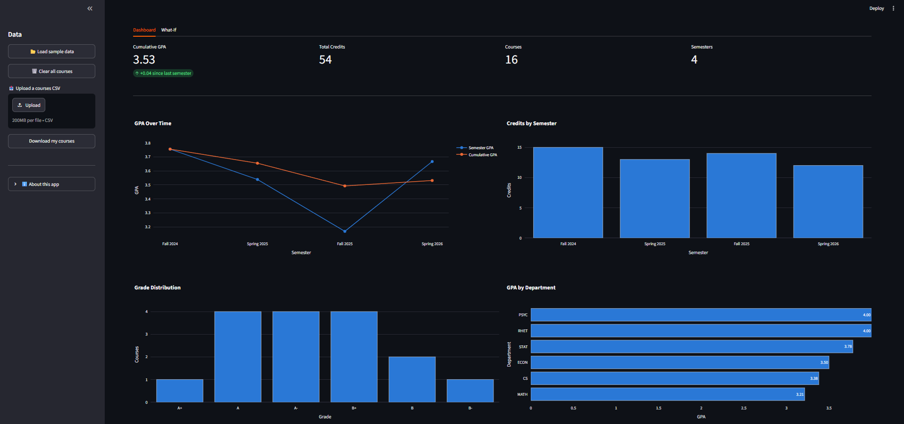

# UIUC Academic Analytics Dashboard

This app is an interactive dashboard for UIUC students. You are able to track your courses, analyze your GPA overtime, look at trends, and look at how your GPA will change in the future based on future grades.




## Some Features

- **GPA tracking:** Tracks semester and cumulative GPA, calculated with the official UIUC 4.0 scale(https://registrar.illinois.edu/courses-grades/explanation-of-grades/)
- **Interactive charts:** Tracks GPA over time, grade distribution, GPA by department, and credits by semester
- **What-if calculator:** Enter planned courses and grades to see your projected GPA
- **Goal mode:** Find the GPA you need next semester to reach a certain cumulative GPA
- **Editable course table:** Dropdowns for grades and semesters to avoid bad inputs
- **CSV upload/download:** Save your courses and load them later with validation and clear error messages
- **Privacy by design:** There is no database and no saved files so data only lives in your browser session.

## Tech


Python used for Core logic
| pandas and NumPy used for data cleaning, grouping, and GPA calculations 
| Plotly used for multiple interactive charts 
| Streamlit used for the web app UI and deployment 
| pytest used for automated tests for the GPA logic 
| Git and GitHub used for version control 

## Project Structure

```
─ app.py                  # Streamlit web app
─ gpa.py                  # GPA math and data validation
─ charts.py               # Plotly chart functions
─ test_gpa.py             # pytest tests for gpa.py
─ data/
   └── sample_courses.csv  # Sample data for the demo
─ docs/
  └── screenshot.png      # README screenshot
─ requirements.txt        # Pinned library versions
─ .streamlit/config.toml  # Theme (I decided for Illini Orange)
```

The math, the charts, and the UI are in separate files so the GPA logic can be tested on its own without the website.

## Design Decisions

- **Credit-weighted GPA.** Cumulative GPA is based on credits, not an average of semester GPAs, a common wrong way to calculate cumulative GPA.
- **Chronological sorting.** Semesters like Fall 2024 automatically sort alphabetically(every Fall before every Spring).
- **Prevents bad input and then validates the rest.** The table uses dropdowns and  files go through a validation function that checks columns. Text normalizes and rejects invalid grades with a specific message.
- **Honest rounding.** Goal mode rounds the best-case GPA down so it never overestimates.

## Run It Locally

```bash
git clone https://github.com/YOUR-USERNAME/uiuc-academic-analytics.git
cd uiuc-academic-analytics
python -m venv .venv
.venv\Scripts\activate          # Windows (Mac/Linux: source .venv/bin/activate)
pip install -r requirements.txt
streamlit run app.py
```

Run the tests:

```bash
pip install pytest
pytest
```

## CSV Format

To upload your own courses, use a CSV with these columns:

```csv
semester,course,department,credits,grade
Fall 2024,CS 124,CS,3,A-
Spring 2025,STAT 107,STAT,4,A
```

## Creator

Veeresh Patil, freshman majoring in Information Sciences + Data Science at the University of Illinois Urbana-Champaign